<h1 align="center">Currency Detector using YOLO</h1>

 

<h2>Step 1: Gather Data</h2>

<ul>
  <li>Gather images of the objects you want the model to detect.</li>
  <li>In this case, we detect Indian currencies.</li>
  <li>For smaller datasets, take 30–40 images per object.</li>
  <li>Use images with different angles, lighting, and backgrounds.</li>
  <li>You can obtain datasets from https://www.kaggle.com/
  </li>
</ul>

  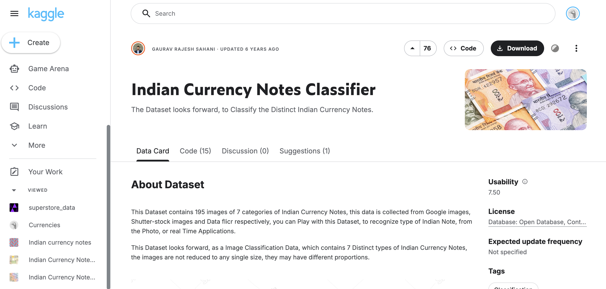

<h2>Step 2: Annotating</h2>

<ul>
  <li>Annotating means drawing a box around an object and assigning it a label.</li>
  <li>This helps the model understand what the object looks like and where it is.</li>
  <li>We will use Roboflow for annotation (free tool).</li>
</ul>

<h3>How to annotate:</h3>

<ol>
  <li>Open https://roboflow.com/ and create an account.</li>

  <li>
    Create a workspace, select public plan, and continue.
  </li>
</ol>

  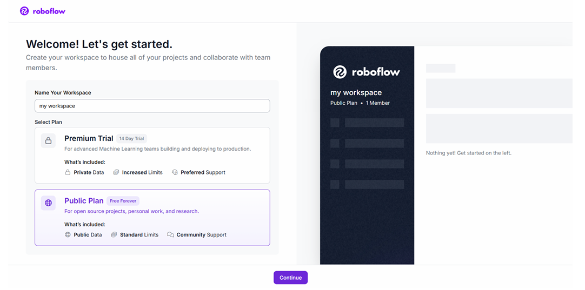

<ol start="3">
  <li>Create a project.</li>
</ol>

  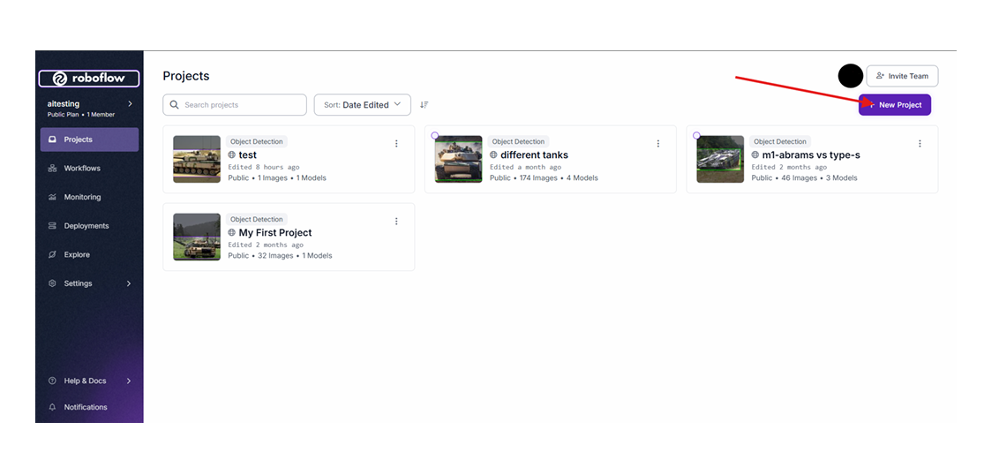

<ol start="4">
  <li>Fill in name, annotation group, select "Object Detection", and create project.</li>
</ol>

  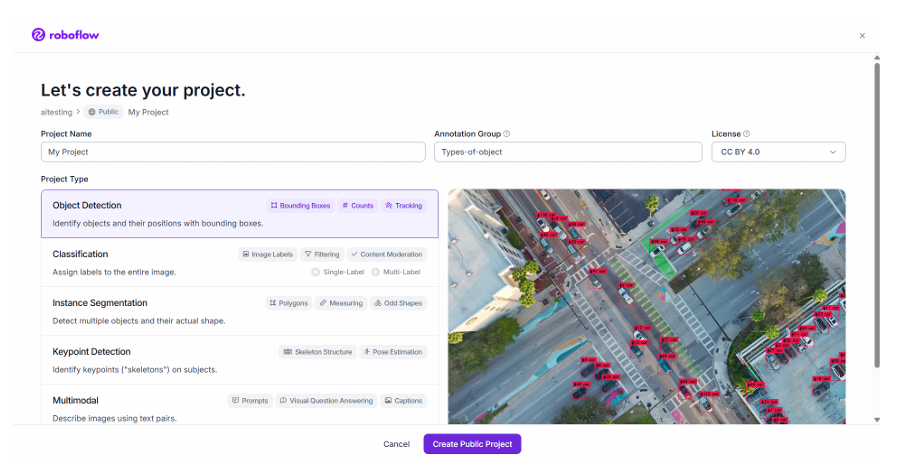

<ol start="5">
  <li>Go to the "Upload Data" tab and upload your images.</li>
</ol>

  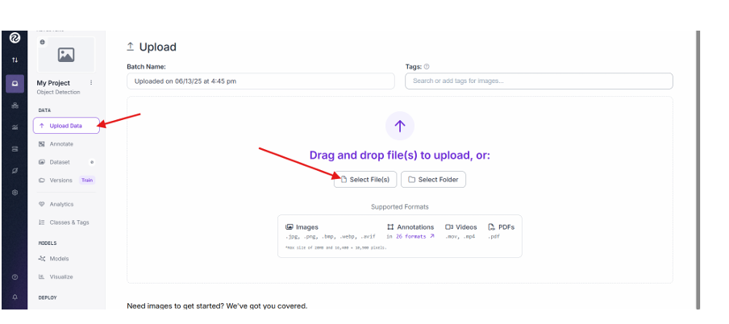

<ol start="6">
  <li>Click on "Start Labelling" → "Assign to Myself".</li>
  <li>Draw bounding boxes around objects and label them.</li>
</ol>

  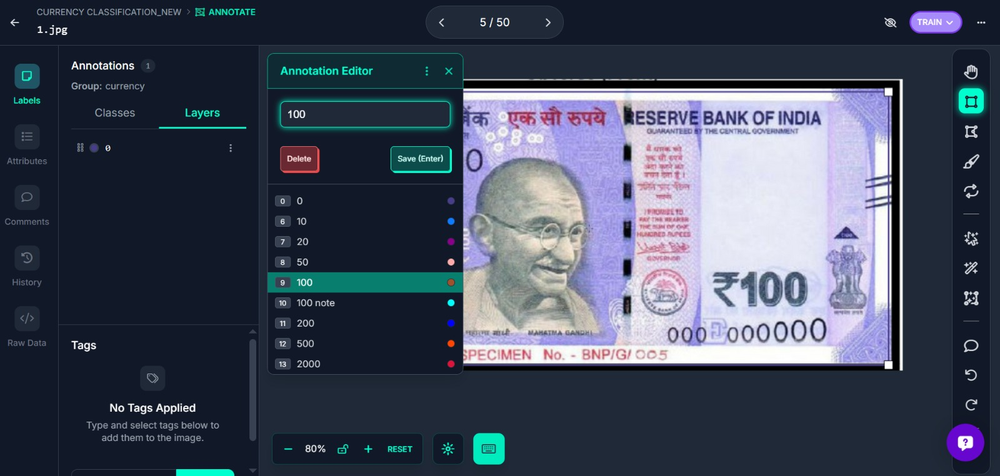

<ol start="8">
  <li>After annotating all images, click "Add to Dataset".</li>
  <li>Preview your dataset.</li>
</ol>

  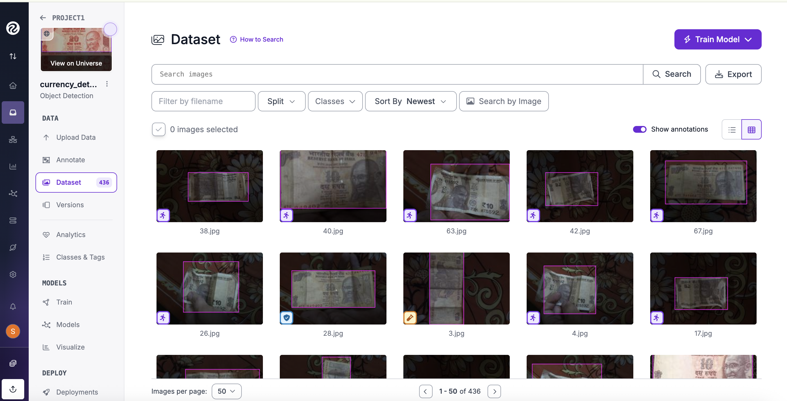

<ol start="10">
  <li>Split data into Train, Validation, and Test sets (recommended split is fine).</li>
</ol>

  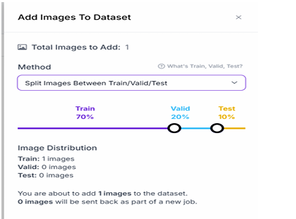

<ol start="11">
  <li>
    Go to "Versions" tab and create a version.
    <ul>
      <li>Augmentation helps improve model robustness.</li>
    </ul>
  </li>
</ol>

<ol start="12">
  <li>Create the version.</li>
</ol>

  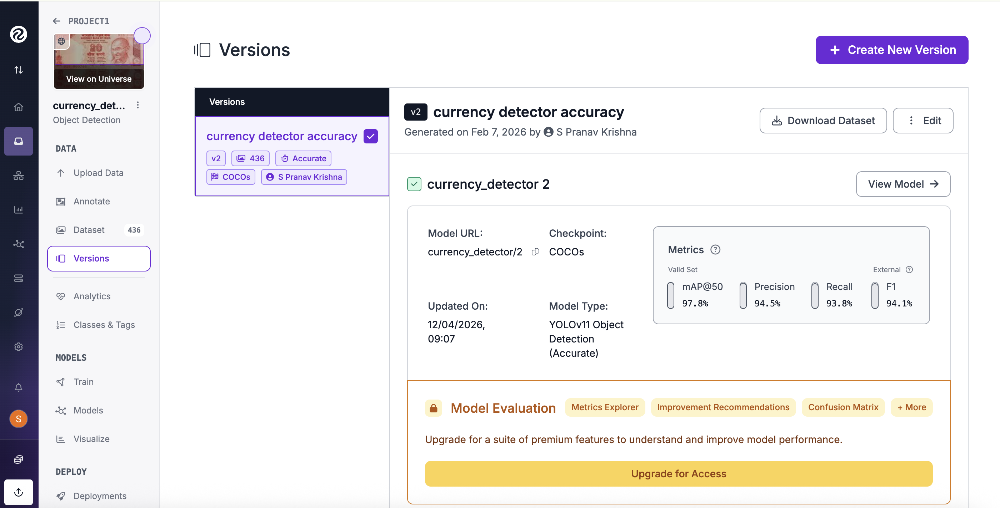

<h2>Step 3: Training the YOLO Model</h2>

<ul>
  <li>After creating the dataset version, click on "Train Model".</li>
  <li>Select the YOLO model version provided by Roboflow.</li>
  <li>Keep default settings if unsure, or adjust parameters as needed.</li>
  <li>Start training and wait for the process to complete.</li>
</ul>

  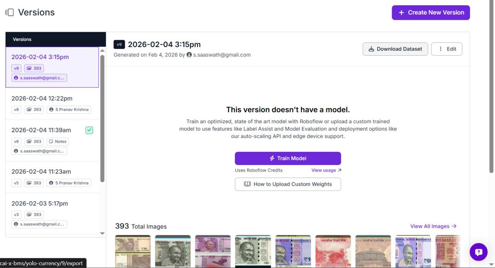

<ul>
  <li>Once training is complete, you will get metrics such as accuracy, precision, and recall.</li>
  <li>Analyze the performance of your model using these metrics.</li>
</ul>

  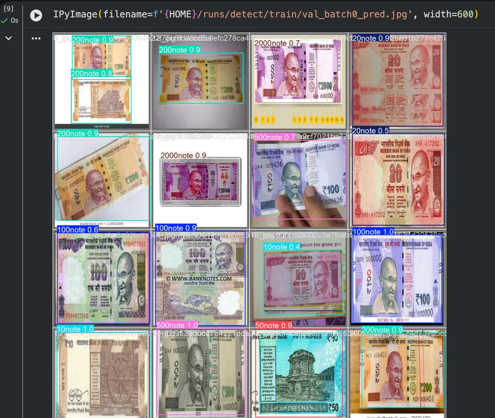

<h2>Step 4: Exporting the Model</h2>

<ul>
  <li>After training, go to the "Deploy" or "Export" tab.</li>
  <li>Select the desired format (e.g., YOLOv8, PyTorch, etc.).</li>
  <li>Download the model weights or copy the API code.</li>
</ul>

  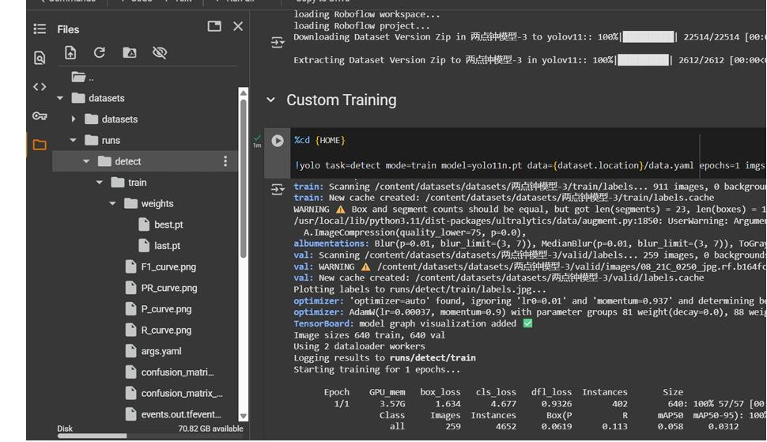

<h2>Step 5: Running the Model</h2>

<ul>
  <li>Load the trained model in your Python environment.</li>
  <li>Use libraries such as OpenCV and Ultralytics YOLO.</li>
  <li>Run inference on images or live video.</li>
</ul>

<pre>
<code>
from ultralytics import YOLO
import cv2

model = YOLO("best.pt")

img = cv2.imread("test.jpg")
results = model(img)

results[0].show()
</code>
</pre>

<h2>Results</h2>

<ul>
  <li>The model is able to detect Indian currency notes.</li>
  <li>Performance depends on dataset quality and training.</li>
  <li>Works well under proper lighting and clear visibility.</li>
</ul>

  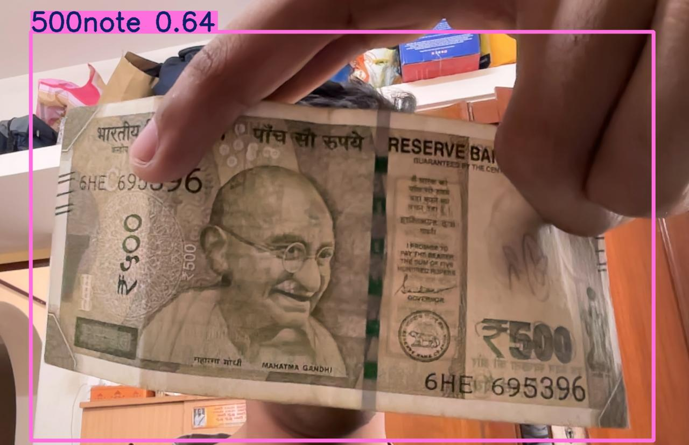

<h2>Future Improvements</h2>

<ul>
  <li>Improve dataset size and diversity.</li>
  <li>Enhance accuracy using better augmentation techniques.</li>
  <li>Implement real-time detection using webcam.</li>
  <li>Deploy on embedded systems like ESP32 or Raspberry Pi.</li>
</ul>
Updated README
